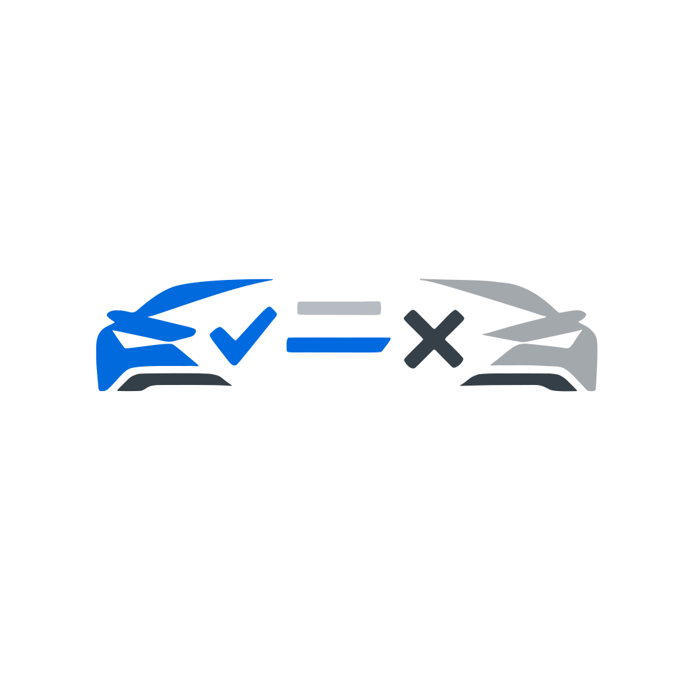

# CUPRA Tavascan Pack Comparator



A web application to visually compare the different equipment packages of the CUPRA Tavascan.

## Live Demo

[Link to live demo]

## Features

- **Pairwise Comparison:** Compare two packages side-by-side.
- **Matrix View:** See a full feature matrix of all available packages.
- **Guided Tutorial:** A step-by-step guide to understanding the package differences.
- **Multi-language Support:** Available in English, German, Spanish, and French.

## Tech Stack

- **React**
- **TypeScript**
- **Vite**
- **i18next**

## Getting Started

To get a local copy up and running, follow these simple steps.

### Prerequisites

- npm

### Installation

1. Clone the repo
   ```sh
   git clone https://github.com/your_username_/Project-Name.git
   ```
2. Install NPM packages
   ```sh
   npm install
   ```

### Running the Application

```sh
npm run dev
```

## Available Scripts

- `dev`: Runs the app in the development mode.
- `build`: Builds the app for production to the `dist` folder.
- `lint`: Lints the project files.
- `type-check`: Performs type-checking with TypeScript.
- `preview`: Serves the production build locally.
